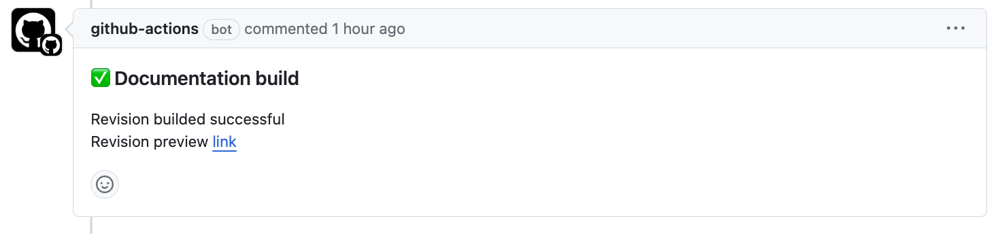
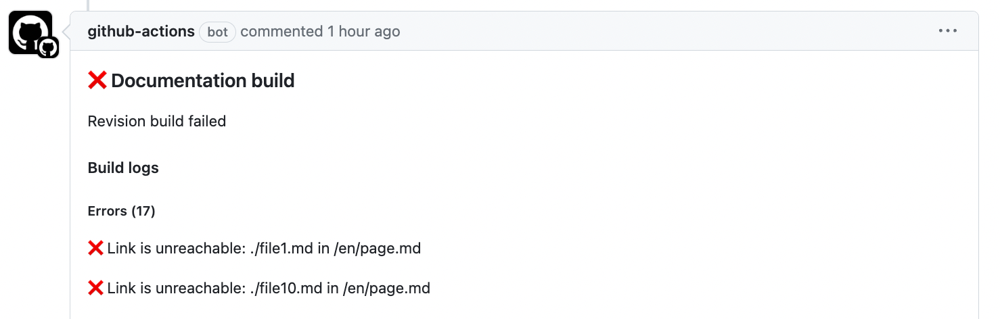

# docs-message-action GitHub action

This GitHub action adds a comment to the pull request with the build log or preview link.

**Successful Build:**


**Failed Build:**


## Inputs

- `github-token` (required) - GitHub access token for authentication and authorization
- `project-link` (required) - The link to the project documentation

## Usage

Create a file named `.github/workflows/post-build.yml` in your repo.

This workflow must run on completed [build workflow](https://github.com/diplodoc-platform/docs-build-action) and performs the following:
- Uploads build output to storage if the build log does not include errors.
- Adds a comment to the pull request with the build log or preview link.

```yaml
name: Upload & Message

on:
  workflow_run:
    workflows: [Build]
    types:
      - completed

jobs:
  post-build:
    permissions: write-all
    runs-on: ubuntu-latest
    steps:
      - name: Upload
        uses: diplodoc-platform/docs-upload-action@v3
        if: github.event.workflow_run.conclusion == 'success'
        with:
          github-token: ${{ secrets.GITHUB_TOKEN }}
          storage-endpoint: ${{ vars.DIPLODOC_STORAGE_ENDPOINT }}
          storage-region: ${{ vars.DIPLODOC_STORAGE_REGION }}
          storage-bucket: ${{ vars.DIPLODOC_STORAGE_BUCKET }}
          storage-access-key-id: ${{ secrets.DIPLODOC_ACCESS_KEY_ID }}
          storage-secret-access-key: ${{ secrets.DIPLODOC_SECRET_ACCESS_KEY }}

      - name: Comment message
        uses: diplodoc-platform/docs-message-action@v3
        with:
          github-token: ${{ secrets.GITHUB_TOKEN }}
          project-link: ${{ vars.DIPLODOC_PROJECT_LINK }}
```
